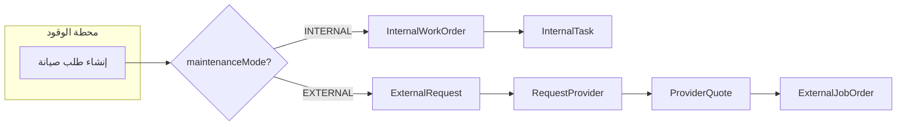

# شرح Internal Order و External Order ومزود الخدمة وحالات الفشل

## 1. الفرق بين Internal و External (من طرف المحطة)

عند إنشاء طلب صيانة من **محطة الوقود** عبر `POST /api/station/maintenance-requests` يتم الاختيار حسب `maintenanceMode` في الـ body:

| النوع        | maintenanceMode        | ماذا يُنشأ                                       | من ينفذ                                |
| ------------ | ---------------------- | ------------------------------------------------ | -------------------------------------- |
| **Internal** | `'INTERNAL'`           | `InternalWorkOrder` + اختياريًا `InternalTask`   | المحطة نفسها (موظفوها)                 |
| **External** | غير INTERNAL (أو بدون) | `ExternalRequest` ثم اختياريًا إرسال RFQ لمزودين | مزودو الخدمة (بعد اختيار العرض والدفع) |

- **الكود الفعلي:** [stationMaintenanceRequest.service.js](E:\ATAM\Taqa\enrgy-BE\src\services\stationMaintenanceRequest.service.js) — الدالة `createMaintenanceRequest`: إذا `body.maintenanceMode === 'INTERNAL'` يتم استدعاء `createInternalWorkOrder` + `createTask`، وإلا يتم إنشاء `ExternalRequest` وربطه بمزودين عبر `RequestProvider` إن وُجد `providerOrganizationIds`.

---

## 2. مزود الخدمة (Service Provider) — ماذا يرى وماذا يفعل؟

- **Internal orders:** مزود الخدمة **لا يرى ولا يتعامل** مع الطلبات الداخلية. الـ Internal Work Orders خاصة بمحطة الوقود فقط (واجهاتها تحت `/api/internal/work-orders` ولا تظهر لمزود الخدمة).
- **External orders:** مزود الخدمة يتعامل فقط مع المسار الخارجي:
  - يرى **طلبات العرض (RFQ)** المرسلة له: عبر `RequestProvider` → `ExternalRequest` (مثلاً قوائم RFQ للمزود).
  - يقدم **عروض أسعار** (`ProviderQuote`) على الـ `ExternalRequest`.
  - عند **اختيار عرضه** من المحطة: يُنشأ `ExternalJobOrder` مرتبط بعرضه + `PaymentRecord`.
  - بعد **تأكيد الدفع ثنائي الخطوة** (المحطة تؤكد الإرسال، المزود يؤكد الاستلام): حالة الـ `ExternalJobOrder` تنتقل إلى `ACTIVE` ويصبح بإمكان المزود:
    - تعيين عامل (`ExternalJobAssignment`),
    - تحديث حالة أمر العمل (`PATCH /api/provider/job-orders/:id/status`),
    - تسجيل زيارة (visit check-in),
    - رفع مرفقات.

التحقق من انتماء الطلب للمزود يتم دائمًا عبر `ProviderQuote.serviceProviderOrganizationId === req.organizationId` (انظر [externalJobOrder.service.js](E:\ATAM\Taqa\enrgy-BE\src\services\externalJobOrder.service.js) و [providerRfq.service.js](E:\ATAM\Taqa\enrgy-BE\src\services\providerRfq.service.js)).

---

## 3. حالات "الفشل" (Fail / نهاية سلبية)

في الكود **لا يوجد status اسمه حرفيًا "FAILED"**. حالات الفشل أو النهاية السلبية هي التالي:

### 3.1 رفض استلام الدفع (Payment Rejected)

- عندما **المزود** يرفض أنه استلم الدفع: استدعاء `providerConfirmReceived` مع `confirm: false` و `rejectionReason`.
- النتيجة: `PaymentRecord.status` ينتقل إلى `**REJECTED`** (طبقًا لـ [stateMachine.service.js](E:\ATAM\Taqa\enrgy-BE\src\services\stateMachine.service.js) — من `STATION_CONFIRMED_SENT` يُسمح بالانتقال إلى `REJECTED` أو `PROVIDER_CONFIRMED_RECEIVED`).
- **الـ ExternalJobOrder** يبقى في حالة `**AWAITING_PAYMENT`** ولا يصل أبدًا إلى `ACTIVE`؛ أي أن أمر العمل "يفشل" من ناحية التنفيذ لأنه لا يُفعّل.
- الكود: [paymentActivation.service.js](E:\ATAM\Taqa\enrgy-BE\src\services\paymentActivation.service.js) — في الفرع `else` (عند الرفض) يتم تحديث الـ `PaymentRecord` إلى REJECTED فقط، دون تغيير حالة الـ Job Order.

### 3.2 إلغاء الطلب أو أمر العمل (Cancelled)

- **ExternalRequest:** يمكن أن ينتقل إلى `**CANCELLED`** من عدة حالات (مثلاً SUBMITTED_BY_STATION, QUOTING_OPEN, AWAITING_PAYMENT، إلخ) حسب [externalRequestTransitions](E:\ATAM\Taqa\enrgy-BE\src\services\stateMachine.service.js).
- **ExternalJobOrder:** يمكن أن ينتقل إلى `**CANCELLED`** من CREATED, AWAITING_PAYMENT, ACTIVE, IN_PROGRESS, إلخ (مع إمكانية إرسال `cancellationReason` في [updateExternalJobOrderStatusSchema](E:\ATAM\Taqa\enrgy-BE\src\schemas\providerJobOrder.schema.js)).
- بمجرد الوصول إلى `CANCELLED` لا يوجد انتقالات تالية (نهاية نهائية).

### 3.3 عرض مرفوض أو منسحب (Quote Rejected / Withdrawn)

- **ProviderQuote** يمكن أن يكون **REJECTED** أو **WITHDRAWN** — الطلب (ExternalRequest) قد يستمر مع مزود آخر أو عرض آخر؛ أي "فشل" بالنسبة لهذا المزود فقط وليس بالضرورة فشل الطلب ككل.

---

## 4. ملخص سريع

- **Internal order:** طلب صيانة تنفذه المحطة داخليًا (InternalWorkOrder + InternalTask). **مزود الخدمة لا يشارك.**
- **External order:** طلب صيانة عبر مزود خدمة: ExternalRequest → RFQ → ProviderQuote → اختيار عرض → ExternalJobOrder + PaymentRecord → بعد تأكيد الدفع (ثنائي الخطوة) يصبح ExternalJobOrder ACTIVE والمزود ينفذ.
- **حالات الفشل المعالجة في الكود:**
  - **Payment REJECTED:** المزود يرفض استلام الدفع → PaymentRecord = REJECTED، ExternalJobOrder يبقى AWAITING_PAYMENT ولا يُفعّل.
  - **CANCELLED:** على مستوى ExternalRequest أو ExternalJobOrder — إلغاء نهائي حسب الـ state machine.
  - لا يوجد status باسم "FAILED"؛ المنطق يعتمد على CANCELLED و REJECTED (للدفع) ونهاية المسار دون تفعيل الـ job (AWAITING_PAYMENT + payment rejected).

إذا قصدت بـ "fail status" حالة معينة أخرى (مثلاً في واجهة المستخدم أو تقرير) فاذكرها يمكن نربطها بالكود بدقة أكبر.