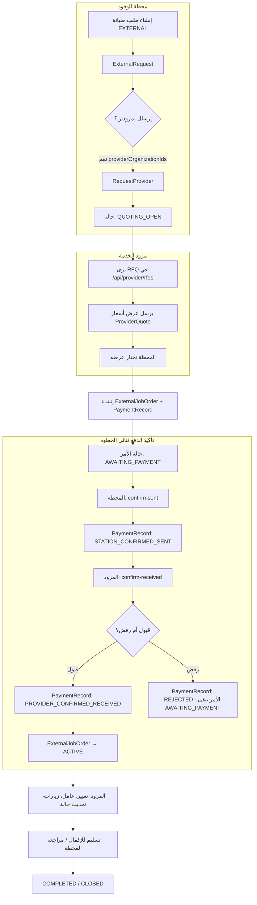

# دورة الطلبات الداخلية والخارجية بين المحطة ومزود الخدمة

هذا الملف يشرح **كيف تتم العملية بالكامل** من إنشاء الطلب عند محطة الوقود حتى استلامه وتنفيذه عند مزود الخدمة، مع الفرق بين **Internal** و **External** والـ APIs المستخدمة في كل مرحلة.

---

## 1) الفرق بين Internal و External (من طرف المحطة)

| النوع | متى يُستخدم | ماذا يُنشأ في النظام | من ينفذ العمل |
|-------|-------------|----------------------|----------------|
| **Internal (داخلي)** | المحطة تريد تنفيذ الصيانة بنفسها (موظفوها) | `InternalWorkOrder` + اختياريًا `InternalTask` | **محطة الوقود** فقط |
| **External (خارجي)** | المحطة تريد تنفيذ الصيانة عبر مزود خدمة | `ExternalRequest` → RFQ → `ProviderQuote` → `ExternalJobOrder` + `PaymentRecord` | **مزود الخدمة** |

- **Internal:** مزود الخدمة **لا يرى** أي شيء؛ كل الواجهات تحت `/api/internal/work-orders` و `/api/station/...` للمحطة فقط.
- **External:** المحطة تنشئ طلبًا خارجيًا، ترسله لمزودين (RFQ)، المزودون يقدمون عروضًا، المحطة تختار عرضًا → يُنشأ **أمر عمل خارجي (External Job Order)**. بعد تأكيد الدفع ثنائي الخطوة يصبح الأمر **ACTIVE** والمزود ينفذ.

---

## 2) دورة الطلب الخارجي (External) — من البداية للنهاية

الرسم التالي يلخص المسار بالكامل:

---

## 3) الخطوات التفصيلية مع الـ APIs

### المرحلة 1: المحطة تنشئ الطلب

| الخطوة | من يفعلها | الـ API | ماذا يحدث |
|--------|-----------|--------|------------|
| إنشاء طلب صيانة (داخلي) | محطة الوقود | `POST /api/station/maintenance-requests` مع `maintenanceMode: "INTERNAL"` | يُنشأ `InternalWorkOrder` + اختياريًا `InternalTask`. **مزود الخدمة لا يشارك.** |
| إنشاء طلب صيانة (خارجي) | محطة الوقود | `POST /api/station/maintenance-requests` مع `maintenanceMode: "EXTERNAL"` واختياريًا `providerOrganizationIds: [1,2,3]` | يُنشأ `ExternalRequest`. إذا وُجدت `providerOrganizationIds` يُنشأ `RequestProvider` لكل مزود مرتبط (ربط ACTIVE) وتصبح الحالة `QUOTING_OPEN`. |

- **ربط المحطة بالمزود:** يجب أن يكون المزود مرتبطًا بالمحطة عبر `StationServiceProvider` بحالة **ACTIVE** حتى يظهر في قائمة المزودين ويرسل له الطلب.
- **إرسال طلب لمزودين لاحقًا:** إذا أنشأت المحطة الطلب بدون `providerOrganizationIds`، يمكن لاحقًا استدعاء `POST /api/station/requests/:id/send-to-providers` مع قائمة المزودين.

---

### المرحلة 2: المزود يرى الطلب (RFQ) ويرسل عرض أسعار

| الخطوة | من يفعلها | الـ API | ماذا يحدث |
|--------|-----------|--------|------------|
| قائمة طلبات العرض (RFQ) | مزود الخدمة | `GET /api/provider/rfqs` | يرى كل الطلبات المرسلة له (التي له فيها سجل `RequestProvider`). |
| تفاصيل RFQ | مزود الخدمة | `GET /api/provider/rfqs/:id` | تفاصيل الطلب ليرسل عليه عرضًا. |
| إرسال عرض أسعار | مزود الخدمة | `POST /api/provider/rfqs/:id/quotes` | يُنشأ `ProviderQuote` (مثلاً بحالة SUBMITTED). |
| مراجعة/سحب عرض | مزود الخدمة | `PATCH /api/provider/quotes/:id` أو `POST /api/provider/quotes/:id/withdraw` | تعديل عرض أو سحبه. |

- **حالات العرض (ProviderQuote):** DRAFT, SUBMITTED, REVISED, WITHDRAWN, REJECTED, SELECTED.

---

### المرحلة 3: المحطة تختار عرضًا → إنشاء أمر العمل والدفع

| الخطوة | من يفعلها | الـ API | ماذا يحدث |
|--------|-----------|--------|------------|
| اختيار عرض | محطة الوقود | `POST /api/station/requests/:id/select-quote` مع `providerQuoteId` | `ExternalRequest` → AWAITING_PAYMENT. يُنشأ **ExternalJobOrder** (حالة AWAITING_PAYMENT) و **PaymentRecord** (NOT_STARTED). العرض يصبح SELECTED. |

من هذه اللحظة:
- **المحطة** ترى أمر العمل في قائمة أوامر المحطة: `GET /api/station/job-orders`.
- **المزود** يراه في قائمة أوامره: `GET /api/provider/job-orders` (لأن الأمر مرتبط بعرضه عبر `ProviderQuote.serviceProviderOrganizationId`).

---

### المرحلة 4: تأكيد الدفع ثنائي الخطوة (تفعيل الأمر)

الأمر يبقى **AWAITING_PAYMENT** حتى يتم تأكيد الطرفين.

| الخطوة | من يفعلها | الـ API | ماذا يحدث |
|--------|-----------|--------|------------|
| تأكيد إرسال الدفع | محطة الوقود | `POST /api/station/job-orders/:id/confirm-sent` (اختياري: referenceNumber, receiptFileUrl, amount, method) | `PaymentRecord` → **STATION_CONFIRMED_SENT**. |
| تأكيد استلام الدفع أو رفضه | مزود الخدمة | `POST /api/provider/job-orders/:id/confirm-received` مع `{ "confirm": true }` أو `{ "confirm": false, "rejectionReason": "..." }` | إذا **قبول:** PaymentRecord → PROVIDER_CONFIRMED_RECEIVED و **ExternalJobOrder → ACTIVE** (ويُسجّل activatedAt). إذا **رفض:** PaymentRecord → REJECTED وأمر العمل **يبقى AWAITING_PAYMENT** ولا يُفعّل. |

- بعد أن تصبح الحالة **ACTIVE**، المزود يستطيع: تعيين عامل، إنشاء زيارات، تحديث حالة الأمر، رفع مرفقات، إرسال تقارير.

---

### المرحلة 5: المزود ينفذ الأمر (بعد ACTIVE)

| الخطوة | من يفعلها | الـ API (أمثلة) | ماذا يحدث |
|--------|-----------|-----------------|------------|
| قائمة أوامر العمل | مزود الخدمة | `GET /api/provider/job-orders` (query: status, page, limit) | كل أوامر العمل المرتبطة بعروض المزود. |
| تفاصيل أمر | مزود الخدمة | `GET /api/provider/job-orders/:id` | تفاصيل الأمر والطلب والدفع. |
| تعيين عامل | مزود الخدمة | `POST /api/provider/job-orders/:id/assign-operator` مع `operatorId` | إنشاء `ExternalJobAssignment`. |
| إنشاء زيارة | مزود الخدمة | `POST /api/provider/job-orders/:id/visits` | إنشاء `ExternalJobVisit`. |
| تسجيل وصول (check-in) | مزود الخدمة | `POST /api/provider/visits/:visitId/checkin` أو `/job-orders/:id/visits/checkin` | تحديث حالة الزيارة. |
| تحديث حالة الأمر | مزود الخدمة | `PATCH /api/provider/job-orders/:id/status` مع `status` (مثلاً IN_PROGRESS, WAITING_PARTS, COMPLETED) | تغيير حالة ExternalJobOrder حسب الـ state machine. |
| إرسال للإكمال/مراجعة | مزود الخدمة | `POST /api/provider/job-orders/:id/submit-completion` | الأمر ينتقل لمراجعة المحطة (مثلاً UNDER_REVIEW). |
| تقارير الصيانة | مزود الخدمة | `POST /api/provider/job-orders/:id/reports` و `GET/.../reports` و `PATCH/.../submit` | إنشاء وتقديم تقارير مرتبطة بأمر العمل. |

**حالات أمر العمل (ExternalJobOrder.status):**  
CREATED, AWAITING_PAYMENT, ACTIVE, IN_PROGRESS, WAITING_PARTS, UNDER_REVIEW, REWORK_REQUIRED, COMPLETED, CLOSED, CANCELLED, SUSPENDED.

---

### المرحلة 6: المحطة تراجع وتغلق (للأوامر الخارجية)

| الخطوة | من يفعلها | الـ API | ماذا يحدث |
|--------|-----------|--------|------------|
| قائمة أوامر العمل | محطة الوقود | `GET /api/station/job-orders` | أوامر العمل الخارجية للمحطة. |
| موافقة/رفض أمر مكتمل | محطة الوقود | `PATCH /api/station/job-orders/:id/review` (مثلاً approve/reject) | حسب الـ state machine — الموافقة قد تنقل إلى CLOSED أو ما يحدده الكود. |

---

## 4) ملخص: أين يشوف كل طرف ماذا؟

| الطرف | Internal (داخلي) | External (خارجي) |
|-------|-------------------|------------------|
| **محطة الوقود** | إنشاء وإدارة من `POST /api/station/maintenance-requests` + `GET/PATCH /api/internal/work-orders/...` | إنشاء طلب من نفس الـ endpoint مع EXTERNAL، قائمة الطلبات `GET /api/station/requests`، اختيار عرض، تأكيد إرسال الدفع، قائمة أوامر العمل `GET /api/station/job-orders` ومراجعة الإكمال. |
| **مزود الخدمة** | **لا يرى ولا يتعامل** | RFQ: `GET /api/provider/rfqs` و `GET /api/provider/rfqs/:id`. عروض: `POST /api/provider/rfqs/:id/quotes`. أوامر عمل: `GET /api/provider/job-orders` و `GET /api/provider/job-orders/:id`. تأكيد استلام الدفع: `POST /api/provider/job-orders/:id/confirm-received`. ثم تعيين عامل، زيارات، تحديث حالة، تقارير من تحت `/api/provider/...`. |

---

## 5) حالات الفشل أو النهاية السلبية

- **رفض استلام الدفع:** المزود يستدعي `confirm-received` مع `confirm: false` → PaymentRecord = REJECTED، وأمر العمل يبقى AWAITING_PAYMENT ولا يصل إلى ACTIVE.
- **إلغاء الطلب أو أمر العمل:** يمكن نقل ExternalRequest أو ExternalJobOrder إلى CANCELLED حسب الـ state machine (مع اختياري `cancellationReason`).
- **عرض مرفوض أو منسحب:** ProviderQuote يصبح REJECTED أو WITHDRAWN؛ الطلب قد يستمر مع مزود أو عرض آخر.

---

## 6) مراجع في الكود

| الوظيفة | الملف |
|---------|-------|
| إنشاء طلب صيانة (Internal/External) | `src/services/stationMaintenanceRequest.service.js` — `createMaintenanceRequest` |
| اختيار عرض وإنشاء ExternalJobOrder + PaymentRecord | `src/services/externalRequest.service.js` — `selectQuote` |
| تأكيد المحطة إرسال الدفع | `src/services/paymentActivation.service.js` — `stationConfirmSent` |
| تأكيد المزود استلام الدفع وتفعيل الأمر | `src/services/paymentActivation.service.js` — `providerConfirmReceived` |
| قائمة/تفاصيل أوامر العمل للمزود | `src/services/externalJobOrder.service.js` — `listForProvider`, `getByIdForProvider` |
| قائمة RFQ للمزود | `src/services/providerRfq.service.js` — `listRfqsForProvider`, `getRfqByIdForProvider` |
| Routes المحطة | `src/routes/station.routes.js` |
| Routes المزود | `src/routes/provider.routes.js` |

---

بهذا تكون الدورة من إنشاء الطلب عند المحطة (Internal أو External) حتى استلام المزود للطلب (RFQ)، إرسال العرض، اختيار المحطة للعرض، تأكيد الدفع ثنائي الخطوة، وتنفيذ المزود لأمر العمل — موثقة بالكامل مع الـ APIs والحالات.
